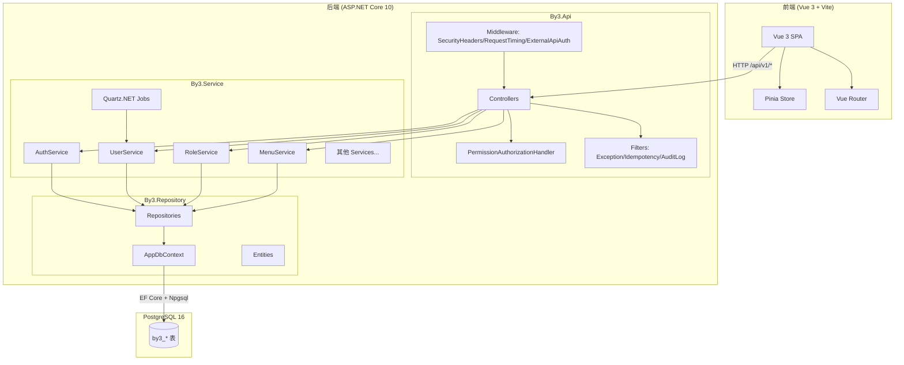
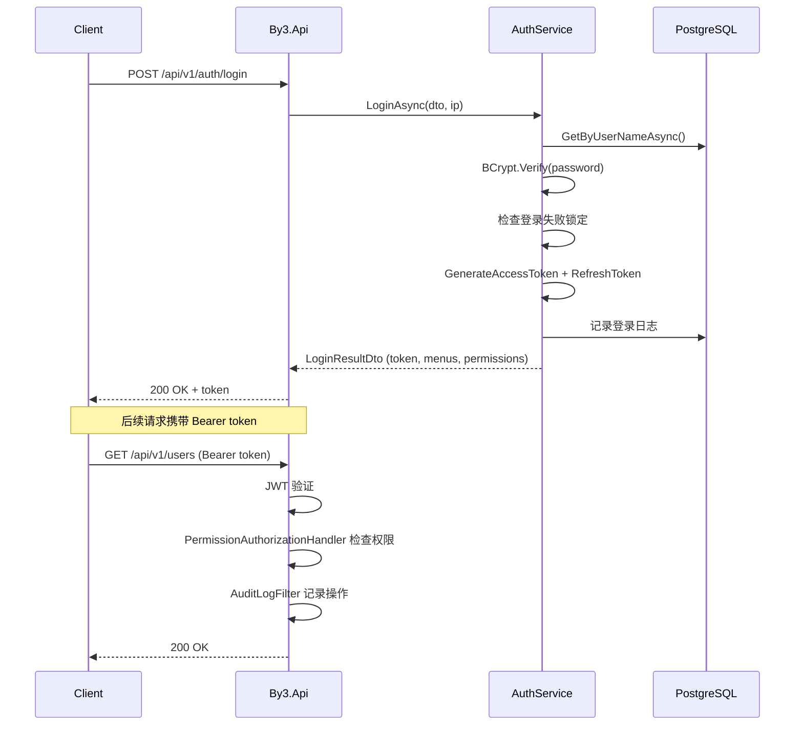
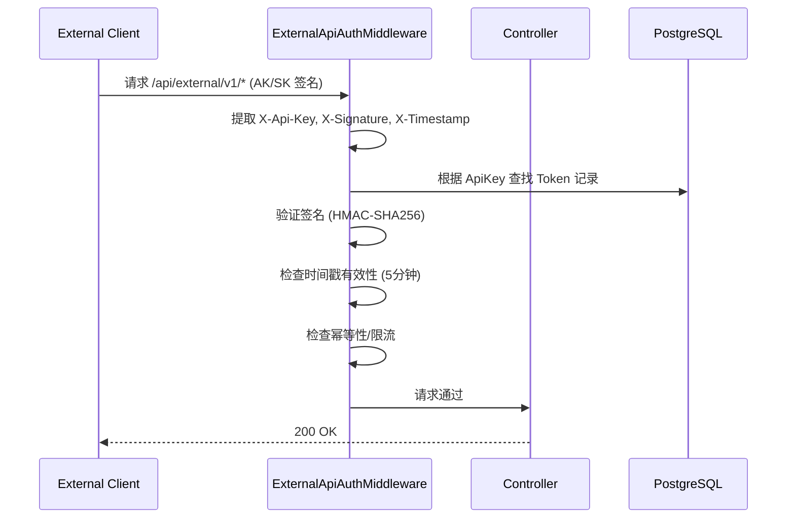

# By3 系统架构图

## 系统架构

```mermaid
graph TB
    subgraph Frontend["前端 (Vue 3 + Vite)"]
        VUE[Vue 3 SPA]
        PINIA[Pinia Store]
        ROUTER[Vue Router]
        VUE --> PINIA
        VUE --> ROUTER
    end

    subgraph Backend["后端 (ASP.NET Core 10)"]
        subgraph ApiLayer["By3.Api"]
            CTRL[Controllers]
            AUTH_H[PermissionAuthorizationHandler]
            FILTER[Filters: Exception/Idempotency/AuditLog]
            MW[Middleware: SecurityHeaders/RequestTiming/ExternalApiAuth]
        end

        subgraph ServiceLayer["By3.Service"]
            AUTH_S[AuthService]
            USER_S[UserService]
            ROLE_S[RoleService]
            MENU_S[MenuService]
            OTHER_S[其他 Services...]
            QUARTZ[Quartz.NET Jobs]
        end

        subgraph RepoLayer["By3.Repository"]
            CTX[AppDbContext]
            REPO[Repositories]
            ENT[Entities]
        end
    end

    subgraph Database["PostgreSQL 16"]
        DB[(by3_* 表)]
    end

    VUE -->|HTTP /api/v1/*| CTRL
    CTRL --> AUTH_H
    CTRL --> FILTER
    MW --> CTRL
    CTRL --> AUTH_S
    CTRL --> USER_S
    CTRL --> ROLE_S
    CTRL --> MENU_S
    AUTH_S --> REPO
    USER_S --> REPO
    ROLE_S --> REPO
    MENU_S --> REPO
    REPO --> CTX
    CTX -->|EF Core + Npgsql| DB
    QUARTZ --> USER_S
```

## 数据库 ER 图

```mermaid
erDiagram
    SysUser {
        uuid Id PK
        string UserName
        string PasswordHash
        string Email
        string Phone "AES加密"
        string RealName
        string Gender
        uuid DepartmentId FK
        uuid PositionId FK
        bool IsEnabled
        bool IsDeleted
        datetime PasswordChangedAt
        datetime CreatedAt
        datetime UpdatedAt
        uuid CreatedBy
        uuid UpdatedBy
    }

    SysRole {
        uuid Id PK
        string RoleName
        string Description
        bool IsEnabled
        bool IsDeleted
        datetime CreatedAt
        datetime UpdatedAt
    }

    SysMenu {
        uuid Id PK
        string MenuName
        string Permission
        string Route
        string Icon
        string Component
        int MenuType "1目录/2菜单/3按钮"
        int SortOrder
        uuid ParentId FK
        bool IsEnabled
        bool IsDeleted
    }

    SysDepartment {
        uuid Id PK
        string DeptName
        string DeptCode
        uuid ParentId FK
        int SortOrder
        bool IsEnabled
        bool IsDeleted
    }

    SysPosition {
        uuid Id PK
        string PositionName
        string PositionCode
        int SortOrder
        bool IsEnabled
        bool IsDeleted
    }

    SysUserRole {
        uuid Id PK
        uuid UserId FK
        uuid RoleId FK
    }

    SysRoleMenu {
        uuid Id PK
        uuid RoleId FK
        uuid MenuId FK
    }

    SysUser ||--o{ SysUserRole : "has"
    SysRole ||--o{ SysUserRole : "has"
    SysRole ||--o{ SysRoleMenu : "has"
    SysMenu ||--o{ SysRoleMenu : "has"
    SysDepartment ||--o{ SysUser : "contains"
    SysPosition ||--o{ SysUser : "has"

    SysDictType {
        uuid Id PK
        string DictName
        string DictType
        bool IsEnabled
    }

    SysDictData {
        uuid Id PK
        uuid DictTypeId FK
        string DictLabel
        string DictValue
        int SortOrder
        bool IsDefault
    }

    SysDictType ||--o{ SysDictData : "has"

    SysAuditLog {
        uuid Id PK
        uuid UserId
        string UserName
        string Action
        string Controller
        string RequestPath
        int StatusCode
        bigint ElapsedMs
        datetime CreatedAt
    }

    SysLoginLog {
        uuid Id PK
        uuid UserId
        string UserName
        bool IsSuccess
        string Message
        string IpAddress
        datetime CreatedAt
    }

    SysFileRecord {
        uuid Id PK
        string FileName
        string OriginalName
        string ContentType
        bigint FileSize
        string StoragePath
        datetime CreatedAt
    }

    SysEmailTemplate {
        uuid Id PK
        string TemplateName
        string TemplateCode
        bool IsEnabled
    }

    SysEmailTemplateVersion {
        uuid Id PK
        uuid TemplateId FK
        int Version
        string Subject
        string Body
    }

    SysEmailTemplate ||--o{ SysEmailTemplateVersion : "has"

    SysEmailSetting {
        uuid Id PK
        string SmtpHost
        int SmtpPort
        string Username
        string Password
        string FromName
        string FromAddress
        bool EnableSsl
    }

    SysJob {
        uuid Id PK
        string JobName
        string JobGroup
        string CronExpression
        string JobType
        string Description
        string ConfigJson
        bool IsEnabled
        bool IsDeleted
        uuid CreatedBy
        uuid UpdatedBy
    }

    SysExternalApi {
        uuid Id PK
        string ApiName
        string Route
        string Method
        string Description
        bool IsEnabled
        bool RequireIdempotency
        int RateLimitPerSecond
        bool IsDeleted
    }

    SysExternalApiToken {
        uuid Id PK
        string AppName
        string ApiKey
        string ApiSecret
        string ExpireType
        datetime ExpireTime
        string AllowedApiIds
        string ContactEmail
        bool IsEnabled
        bool IsDeleted
        datetime PreviousValidUntil
        string PreviousApiKey
        string PreviousApiSecret
        uuid CreatedBy
        uuid UpdatedBy
    }
```

## 认证流程

```mermaid
sequenceDiagram
    participant C as Client
    participant API as By3.Api
    participant AUTH as AuthService
    participant DB as PostgreSQL

    C->>API: POST /api/v1/auth/login
    API->>AUTH: LoginAsync(dto, ip)
    AUTH->>DB: GetByUserNameAsync()
    AUTH->>AUTH: BCrypt.Verify(password)
    AUTH->>AUTH: 检查登录失败锁定
    AUTH->>AUTH: GenerateAccessToken + RefreshToken
    AUTH->>DB: 记录登录日志
    AUTH-->>API: LoginResultDto (token, menus, permissions)
    API-->>C: 200 OK + token

    Note over C,API: 后续请求携带 Bearer token

    C->>API: GET /api/v1/users (Bearer token)
    API->>API: JWT 验证
    API->>API: PermissionAuthorizationHandler 检查权限
    API->>API: AuditLogFilter 记录操作
    API-->>C: 200 OK
```

## 外部 API 签名认证流程

```mermaid
sequenceDiagram
    participant C as External Client
    participant MW as ExternalApiAuthMiddleware
    participant API as Controller
    participant DB as PostgreSQL

    C->>MW: 请求 /api/external/v1/* (AK/SK 签名)
    MW->>MW: 提取 X-Api-Key, X-Signature, X-Timestamp
    MW->>DB: 根据 ApiKey 查找 Token 记录
    MW->>MW: 验证签名 (HMAC-SHA256)
    MW->>MW: 检查时间戳有效性 (5分钟)
    MW->>MW: 检查幂等性/限流
    MW->>API: 请求通过
    API-->>C: 200 OK
```
